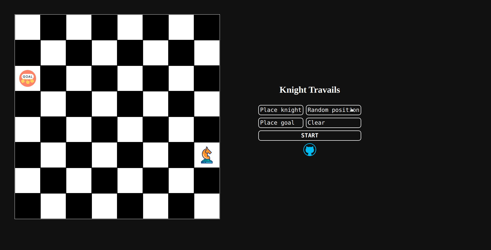
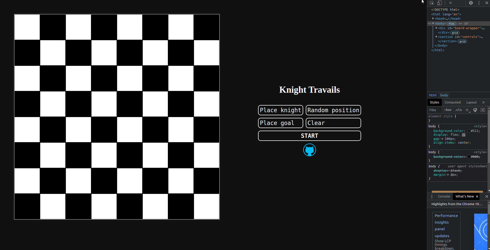

# Knight Travails

Visualization of pathfinding of a knight chess piece. Made with Typescript, HTML5 and CSS3. See it live [here](https://bofmar.github.io/knight-travails/).

## How to use
1. Select the starting location for the knight by pressing the `Place knight` button and then a square on the board.
2. Select the target location for the knight by pressing the `Place goal` button and then a square on the board.
3. Alternative, press the `Place random` button to get a random setup.
4. Press the `Start` button.
5. Reset everything by pressing the `Clear` button.

The site is also responsive, so it can be used on mobile devices

### Credits
SVGs taken from [SVG repo](https://www.svgrepo.com/)